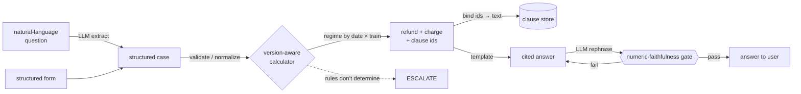

# Entitled — a rules-grounded agent for Indian Railways ticket refunds

[](https://github.com/gtushar05/entitled/actions/workflows/ci.yml)


**Describe your ticket cancellation in plain English; get the exact refund you're
owed — computed deterministically from the governing rules, cited to the clause,
and version-aware by cancellation date and train type.**

The language model never does the arithmetic. It turns your words into structured
facts and rephrases the answer; a **deterministic, version-aware calculator**
produces every rupee figure, and a **numeric-faithfulness gate** verifies each
number the model writes before you see it. When the verified rules don't
determine the answer, the agent **escalates instead of guessing**.

> **Why this has to be version-aware:** the refund rules changed twice in 2026.
> As cached in this repo's own corpus (with SHA-256 hashes and fetch dates),
> **IRCTC's official rules page still displays the superseded 2015 tiers** — the
> official sources currently disagree with each other. This agent cites the
> gazette, and tags every answer with the regime it applied.

---

## The trap, in one example

The **same** ₹2,400 second-AC ticket, cancelled comfortably early, on two
different trains — because the January-2026 rules removed the old "flat charge
only" band for Vande Bharat Sleeper / Amrit Bharat trains:

```
Regular train (2015 rules), cancelled 60h before:
  Refund ₹2,200 of ₹2,400  (charge ₹200 — flat)
  Basis: [2015/rule-6] G.S.R. 836(E)

Vande Bharat Sleeper (Jan-2026 rules), cancelled 102h before:
  Refund ₹1,800 of ₹2,400  (charge ₹600 — 25%, no flat-only band)
  Basis: [jan2026/6(4)(a)] CC 08/2026 carrying G.S.R. 41(E)
```

A reader of IRCTC's own website would get the second one wrong. So does an LLM
asked to do the math itself — see the ablation below.

---

## Results (all reproducible from this repo)

| What | Result |
|---|---|
| **Frozen golden set** (hand-adjudicated oracle) | **70/70 exact**, 31/31 traps, refund exactness 100%, citation accuracy 100% |
| **Dangerous computes** (should refuse, answered anyway) | **0** |
| **Natural-language extraction** (question → structured → outcome) | **97.1%** outcome accuracy, 100% refund exactness given correct outcome |
| **Numeric-faithfulness gate** vs. an independent LLM judge | validator **81.8%**, judge 100%, **κ = 0.64** (disagreeing only on the one blind spot) |
| **Calculator necessity** — LLM alone, given the clauses, no calculator | **31%** on traps vs. the verified system's **100%** |
| **Provider frontier** (Haiku vs. Sonnet) | extraction 100% vs 90%; **$1.30 vs $3.41 / 1k queries** |

Every number above is produced by a script in [`scripts/`](scripts/) and pinned
by a test; the golden set is SHA-256-stamped so it can't drift silently.

---

## How it works



**The doctrine — a verified component owns the money.** The LLM has exactly two
jobs, both guarded: *extraction* (its output is validated into a `TicketCase`
before anything runs) and *rephrasing* (its output is checked number-by-number
against the calculator's, and killed back to the template on any mismatch). It
is never trusted with a rupee figure.

**Three rule regimes**, selected by cancellation date and train type:

- **R2015** — G.S.R. 836(E), OCR'd from the 29-page scanned gazette in this repo.
- **VB2026** — G.S.R. 41(E) via Railway Board CC 08/2026, **verified from the
  primary text layer** (Vande Bharat Sleeper / Amrit Bharat 2.0: >72h → 25%,
  72–8h → 50%, <8h → nil).
- **APR2026** — the all-trains reform (72/24/8). The percentage tiers are
  confirmed by the government's own announcement, but the **primary circular is
  not yet published**, so any branch whose outcome depends on the unconfirmed
  flat minimums **escalates rather than guesses** — a pre-committed rule, not a
  judgment call at answer time.

18 source documents are cached with provenance (hashes + fetch dates) in
[`corpus/MANIFEST.json`](corpus/MANIFEST.json); the clause store is 31
regime-tagged clauses.

---

## Why the calculator earns its place

The central claim — "don't let an LLM do the money math" — is measured, not
asserted. Given the exact governing clauses in context but **no calculator**, an
LLM was asked to compute the refund itself on the 29 hardest (trap) cases:

- **31% fully correct**, versus the verified system's **100%**.
- **0** fabricated/over-payment amounts — and this is the honest surprise: the
  model wasn't *reckless*, it was **paralyzed**. On **12 of 29** cases it
  abstained (escalated) on a refund that was actually **due**, and on several
  more it failed to apply a clear no-refund rule.

So a pure-LLM product wouldn't rob the railway; it would frustrate passengers by
denying legitimate refunds, while still being wrong two-thirds of the time on the
hard cases. A 200-line deterministic calculator turns that into 100% exact, for
free. *(Caveats, recorded honestly: the trap subset is the hardest slice, this
is the Haiku tier, and a larger model would close some of the gap.)*

The retrieval layer got the same honest treatment: on this 31-clause corpus the
BM25+dense **hybrid ≈ BM25** (both 62% recall@3); dense embeddings help only on
low-overlap paraphrases, and even that win doesn't survive RRF fusion here. It's
reported straight rather than dressed up — and it has bounded blast radius,
because citations bind by exact clause id from the calculator, not by retrieval.

---

## Run it

```bash
python -m venv .venv && . .venv/bin/activate
pip install -e ".[agent,dev]"        # rank-bm25, model2vec/sentence-transformers, anthropic, pytest

pytest -q --ignore=tests/test_corpus.py      # 133 tests
python scripts/reconcile_golden.py           # frozen oracle vs. live agent
python scripts/day8_eval.py                  # golden-set evaluation report
python scripts/day11_ablation.py             # retrieval ablation (offline)
```

The natural-language and provider-frontier scripts use a provider chain
(`ANTHROPIC_API_KEY` → `claude` CLI → deterministic fallback); they degrade
gracefully with no provider. The demo (`space/`) is a Gradio app whose
calculator tab runs with no model at all — `bash scripts/build_space.sh`
assembles a self-contained Hugging Face Space.

---

## Repo map

| Path | What |
|---|---|
| `src/entitled/calculator.py` | the deterministic, version-aware refund calculator |
| `src/entitled/parser.py` · `agent.py` | intake validation → cited-answer composition |
| `src/entitled/extract.py` · `explain.py` | LLM extraction + validator-gated rephrasing |
| `src/entitled/retrieval.py` · `judge.py` · `bench.py` · `ablation.py` | hybrid retrieval, LLM-judge κ, provider frontier, ablations |
| `data/golden.json` | the 70-case frozen oracle (SHA-256-stamped) |
| `corpus/` | cached sources + provenance + the clause store |
| `reports/` | every headline number above, as JSON + an SVG frontier chart |
| `space/` | the Gradio demo |

---

Sibling project, same doctrine (verified components own the decision, the LLM is
guarded): [**Incremental**](https://github.com/gtushar05/incremental) — a causal
uplift targeting engine with a pre-registered golden holdout.
